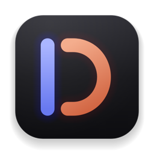
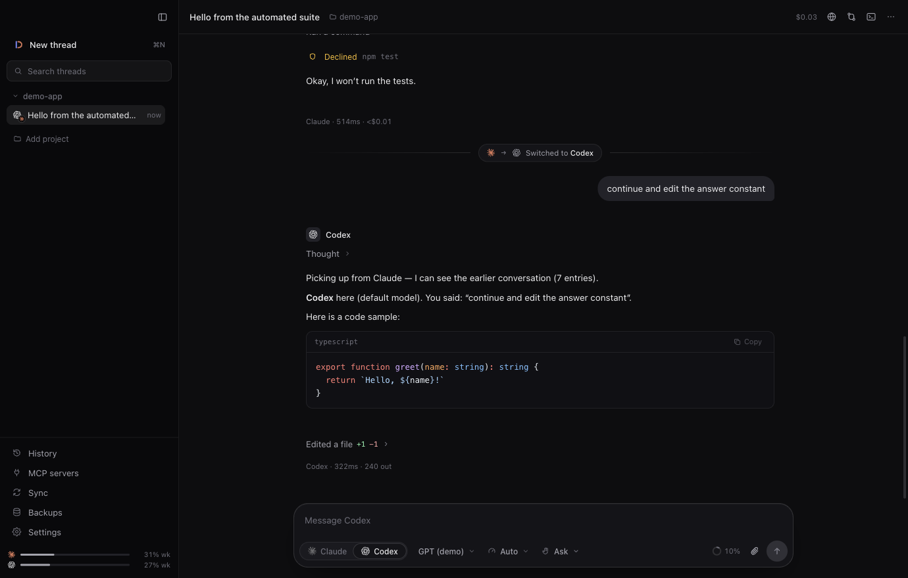
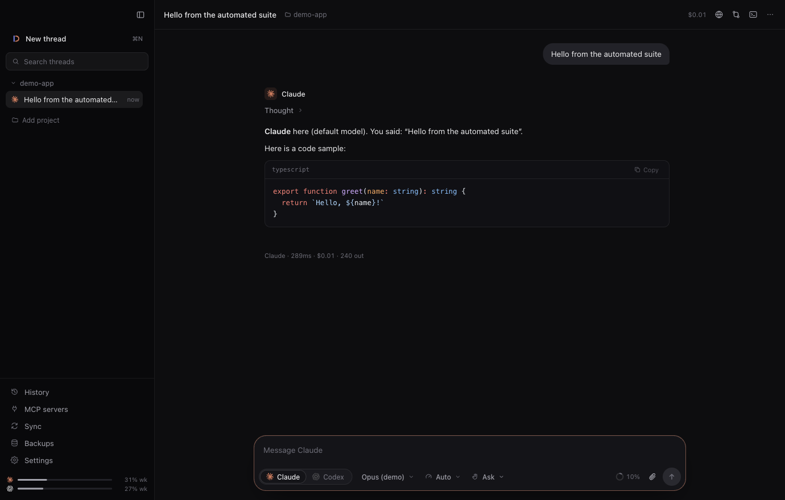
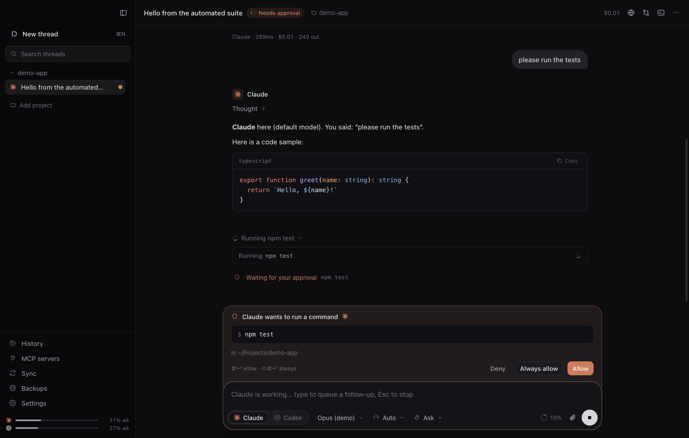
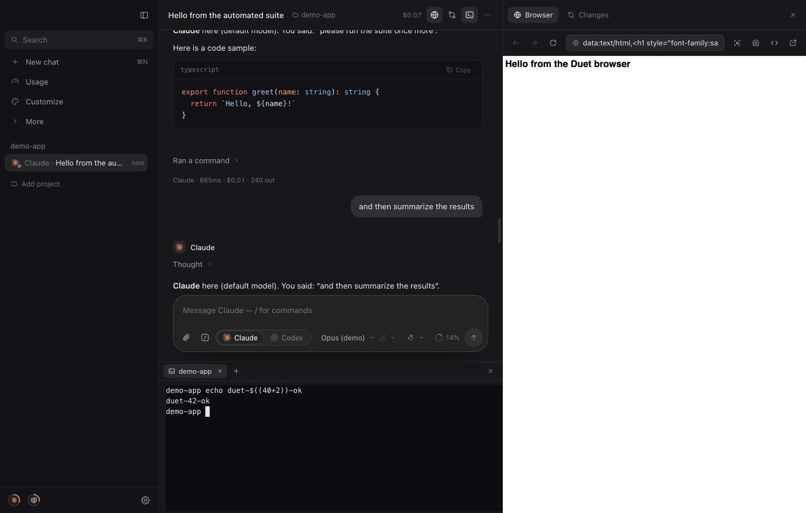
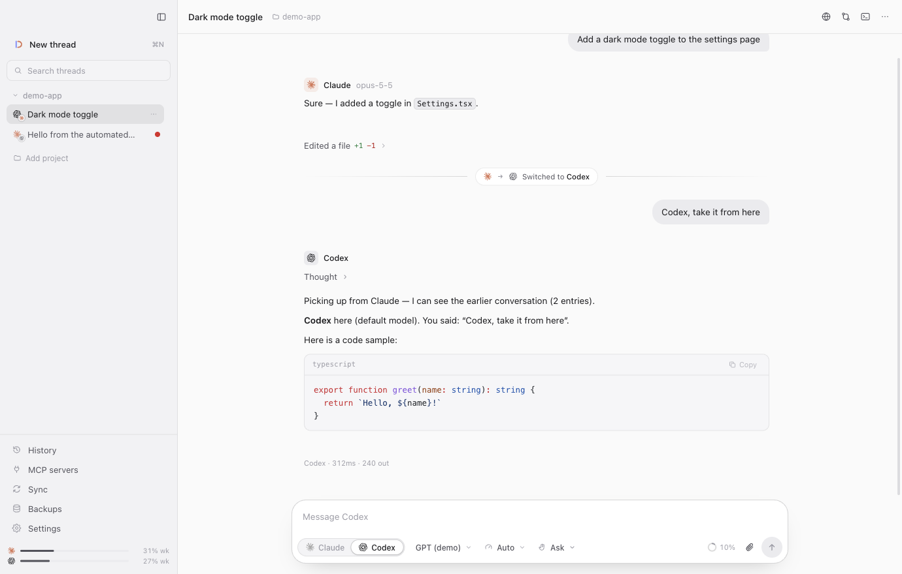
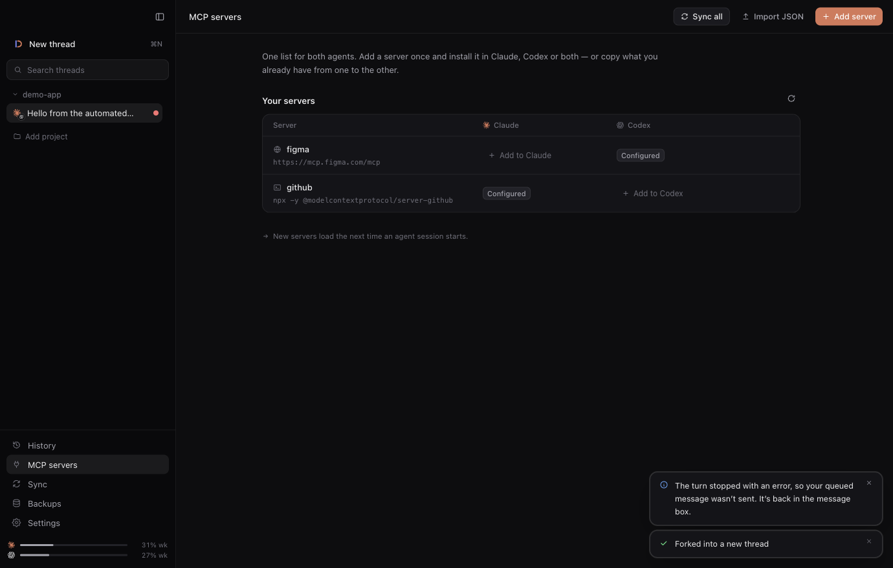
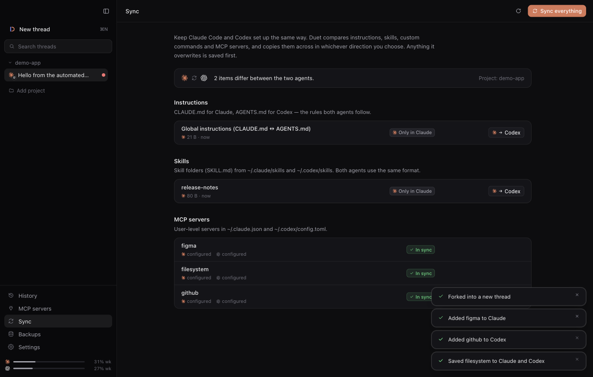
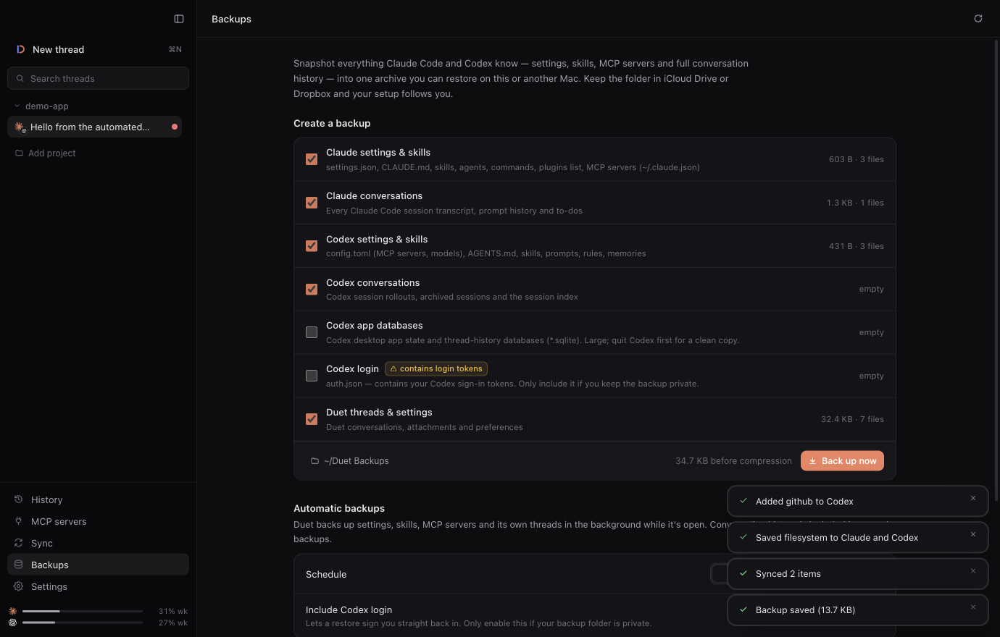
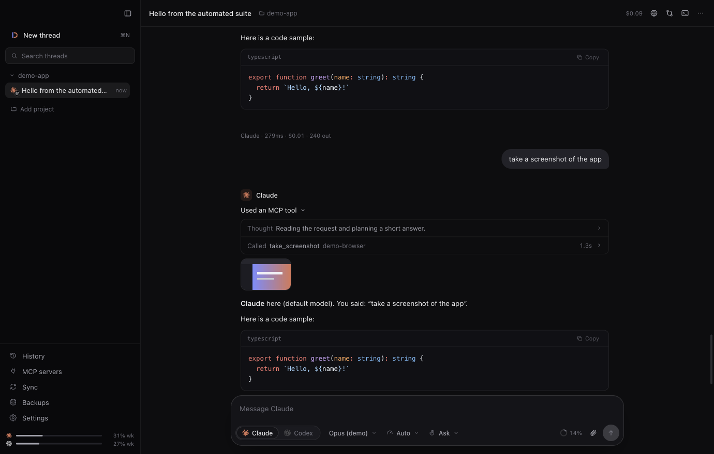

<p align="center">
  
</p>

<h1 align="center">Duet</h1>

<p align="center"><b>Claude Code and Codex in one window.</b><br/>Start with either agent, switch mid-thread, and the other one picks up exactly where the first left off.</p>

<p align="center">
  
</p>

Duet is a native-feeling macOS desktop app (Electron/Chromium) that drives the **Claude Code** and **OpenAI Codex** command-line agents already installed on your Mac, with your own subscriptions. It talks to each one through its official streaming protocol — Claude Code's `stream-json` control protocol and Codex's `app-server` JSON-RPC — so you get live streaming, tool calls, diffs and approvals from both, in one consistent UI.

## Features

**Two agents, one thread**
- Switch agents with one click (or <kbd>⌘1</kbd> / <kbd>⌘2</kbd>). The whole UI fades from Claude terracotta to Codex periwinkle.
- Each agent keeps its own native session. When you switch, Duet hands the other agent a compact transcript of what it missed — messages, commands run, files edited — so it continues seamlessly. Switch back and only the new part is handed over.
- One model picker for both agents (switching models across agents switches the agent), reasoning effort, and four permission modes: **Plan**, **Ask**, **Auto-edit**, **Full access**.

**A great place to work with agents**
- Streaming markdown with syntax highlighting, and Claude Code-style work logs: one plain line per step ("Ran `npm test`", "Edited `src/app.ts` +3 −1", "Called `take_screenshot`") that opens into commands with live output, diffs, MCP calls and subagents, plus live plans/to-dos.
- Screenshots and other pictures that tools return (MCP screenshot tools, image viewers, generated images) show right in the conversation — click one for full size.
- Approvals docked above the composer: run/deny commands, review diffs before edits, approve plans, answer agent questions. <kbd>⌘↵</kbd> allow · <kbd>⇧⌘↵</kbd> always allow · <kbd>Esc</kbd> stop.
- Images: paste, drag & drop or attach; both agents see them.
- `/` slash commands and `@` file mentions in the composer.
- Live usage meters for both subscriptions (5-hour / weekly limits) and a context-window meter.
- Notifications and a dock badge when an agent finishes or needs you.

**Built-in tools**
- **Browser** — a real Chromium browser panel for your dev server. Click **Pick element** to send an element's HTML, styles and a cropped screenshot straight into your message, or attach a full screenshot.
- **Changes** — live git status and diffs for the project.
- **Terminal** — a real shell (multiple tabs) in the project folder.
- ⌘K command palette for everything.

**Your data, both ways**
- **History** — every Claude Code session and Codex thread on your Mac, searchable. Open one to continue it with the same agent, or hand it to the other agent.
- **MCP servers** — one list showing each server's status in Claude and Codex side by side. Add a server once and install it in either or both, import from JSON, or copy what you have from one agent to the other. Writes go through each agent's own tooling (`claude mcp`, Codex `config/batchWrite`) so your config files keep their formatting.
- **Sync** — compare and copy instructions (`CLAUDE.md` ⇄ `AGENTS.md`), skills, custom commands/prompts and MCP servers in either direction, or "newest wins". Anything overwritten is saved first.
- **Backups** — snapshot settings, skills, MCP config and full conversation history of both agents (plus Duet's own threads) into one `.tar.gz`, restore on this or another Mac, optional daily/weekly automatic backups. Restores always take a safety backup first.

## Screenshots

| | |
|---|---|
|  |  |
|  |  |
|  |  |
|  |  |

## Requirements

- macOS on Apple Silicon.
- **Claude Code** (`claude`), signed in — `curl -fsSL https://claude.ai/install.sh | bash`, then `claude auth login`.
- **Codex** (`codex`), signed in — `npm i -g @openai/codex`, then `codex login`. Duet also finds the Codex CLI bundled inside the ChatGPT app.

Duet auto-detects both from your shell `PATH` and common install locations; you can point it at a specific binary in **Settings → Agents**.

## Install

Open `release/Duet-1.0.0-arm64.dmg` and drag **Duet** to Applications (or unzip `Duet-1.0.0-arm64-mac.zip`). The build is ad-hoc signed; if macOS blocks the first launch, right-click the app and choose **Open**.

## Develop

```bash
npm install          # also rebuilds node-pty for Electron
npm run dev          # hot-reloading dev app
npm run typecheck
npm test             # unit tests (vitest)
npm run test:e2e     # builds, then drives the app with Playwright using demo agents
npm run test:live    # real Claude Code + Codex (uses your subscriptions, tiny prompts)
npm run dist         # DMG + zip into ./release
```

`DUET_FAKE_PROVIDERS=1 npm run dev` runs the app with deterministic demo agents (no CLIs or accounts needed). `npm run icons` re-renders `build/icon.png` from `build/icon.svg`.

## How switching works

Every Duet thread stores its own timeline plus, per agent, the id of that agent's native session and how much of the timeline that session has already seen. When you send a message:

1. If the chosen agent has never been in this thread, Duet starts a native session and prepends the conversation so far.
2. If it has, Duet resumes its native session (`claude --resume`, Codex `thread/resume`) and only sends what happened since its last turn. For Codex the hand-off is injected natively as history (`thread/inject_items`); for Claude it is a compact preamble.
3. If a native session can't be resumed anymore, Duet transparently starts a fresh one with the full transcript.

## Where your data lives

- Duet: `~/Library/Application Support/Duet` (threads, attachments, settings).
- Claude Code: `~/.claude`, `~/.claude.json`. Codex: `~/.codex`.
- Backups default to `~/Documents/Duet Backups`; change it in **Backups**.

Nothing leaves your Mac except the agents' own API traffic.

## Architecture

```
src/
  main/                 Electron main process
    providers/claude    stream-json control protocol: process, mapper, tool/approval descriptions
    providers/codex     app-server JSON-RPC client, item mapper, adapter
    providers/fake      deterministic demo agents for tests
    orchestrator.ts     threads, turns, approvals, hand-offs, persistence
    handoff.ts          budgeted transcript for agent switches
    features/           mcp, sync, backup, history, git, files, terminal, attachments
  preload/              contextBridge API (typed by src/shared/api.ts)
  renderer/             React 19 + Tailwind 4 UI
  shared/               types, diff engine, path helpers
tests/
  unit/                 vitest
  e2e/                  Playwright + Electron (demo agents)
  live/                 real CLIs (opt-in)
```

Security: the window runs sandboxed with context isolation, every IPC call is checked against the main window, the embedded browser runs in its own sandboxed partition without preload access, and local images are served through a read-only, image-only protocol.
